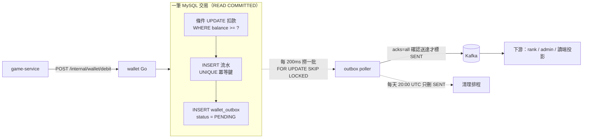

# 幸運星幣城 — Java → Go 全面重構

[](https://github.com/AlexChang1999/lucky-star-casino-go/actions/workflows/ci.yml)
[](https://go.dev/)
[](test/contract/README.md)
[](AGENTS.md)

把一個**正在跑的** Java 21 / Spring Boot 微服務平台（7 個服務、555 個 `.java`）
逐服務重構為 Go，並用**黑箱契約測試**證明每一步都等價。

> **這不是「用 Go 寫一個娛樂城」，是「把一個在跑的系統換掉引擎」。**
> 差別在於：每個行為都有一個**已存在的正確答案**——工作是對齊它，不是發明它。
> 而「證明對齊了」需要證據：**同一份契約測試，對 Java 版與 Go 版都要綠。**

<sub>**EN** — Rewriting a running 7-service Java/Spring Boot casino platform into Go,
service by service, proving equivalence with a **black-box contract suite that runs
against both implementations**. Focus: accounting correctness (idempotency keys,
optimistic locking), distributed consistency (Transactional Outbox), and the
**silent failure modes** of a PostgreSQL → MySQL migration.</sub>

---

## 現在能證明什麼

**全部是實測輸出，不是規劃**（`AGENTS.md` §2.7：效能數字一律實測，不可虛構）。

| 證據 | 數字 | 出處 |
|---|---|---|
| **跨語言等價** | 同一份契約測試 **11 項 / 15 個表格子項**，對 **Java（:8082）與 Go（:8182）兩邊全綠** | [`test/contract/`](test/contract/README.md) |
| **帳務併發** | 20 筆同玩家併發扣款（不同冪等鍵）**全部成功**；同條件的入帳是 **1 成功、19 個 409** | `TestCreditConcurrentSamePlayer` |
| **MySQL gap lock 死鎖** | REPEATABLE READ 下 20 筆併發下注 **19 筆撞 1213**；改 READ COMMITTED 後 0 筆 | [地雷 #34](AGENTS.md) |
| **事件端到端延遲** | 下注 → outbox → Kafka **208–372 ms**（poll interval 200ms 決定） | CHANGELOG 2026-08-02 |
| **kafka-go 預設值代價** | 單則 produce **12.6 ms**；不改 `BatchTimeout` 是 **1 秒起跳** | `TestPublisherDoesNotWaitForBatchTimeout` |
| **映像大小** | wallet **36.3 MB**（scratch + `CGO_ENABLED=0`）；前導專案 notify-go 18.6 MB | CI job summary |
| **無聲失敗清單** | **39 條**已記錄地雷，多數的共同點是**完全沒有錯誤訊息** | [`AGENTS.md` §2](AGENTS.md) |

---

## 目前狀態

🚧 **Phase A（wallet）施工中**。帳務核心、事件投遞與跨語言契約測試已可跑。

| 項目 | 狀態 |
|---|---|
| 基礎設施（MySQL / MongoDB / Redis / Kafka） | ✅ compose 一鍵起 |
| 連線層 `internal/platform`（設定驗證、連線池、migration） | ✅ 表格驅動測試 |
| `wallet` 帳務：debit / credit（冪等鍵、樂觀鎖、補償回沖） | ✅ `-race` 併發測試 |
| `wallet` HTTP 與 `cmd/wallet` | ✅ 逐字對齊 Java 的端點契約 |
| `wallet` Transactional Outbox → Kafka（poller + 清理排程） | ✅ 端到端實測 208–372ms |
| **跨語言契約測試** | ✅ **Java / Go 兩邊全綠** |
| CI/CD（lint → 單元 → **真的起 MySQL+Kafka** → 契約 → 建映像） | ✅ 五個 job |
| `member.registered` consumer、CQRS 讀端投影 | ⬜ 下一步 |
| gateway / game / member / rank / admin | ⬜ Phase B–F |

**前導專案**：`notification-service` →
[**lucky-star-notify-go**](https://github.com/AlexChang1999/Lucky_Star_Notify_Go)
（**自幹 STOMP 1.2 伺服器子集**、契約測試 14/14 兩邊全綠、映像 18.6 MB、閒置 12.9 MiB）。
**那是本重構的方法論驗證**——證明「黑箱契約測試 + 逐服務替換」這條路走得通。

---

## wallet 的資料流（Phase A 的成果）



**三個不能妥協的點**，每一個都有測試釘住：

1. **業務寫入與事件寫入在同一筆交易裡**（Transactional Outbox）——
   直接送 Kafka 意味著「DB 成功、送 Kafka 失敗」時事件永遠遺失，而餘額已經變了。
2. **確認送達（`acks=all`）才標 SENT**——猜測或非同步送出就回報成功，
   等於讓資料庫說「已送出」而事件不在 Kafka 裡，**比沒有 outbox 更糟**。
3. **只刪 SENT，PENDING 無論多舊都不刪**——刪掉就是無聲丟失事件。

---

## 這個專案想證明什麼

不是「我會用 Go」，而是這四件事：

### 1. 能讀懂一份架構決策，並且有根據地推翻它

團隊的 ADR-000 正式決定過「用 **Java** 而不是 Go」。
[本專案的 ADR-000](docs/ADR-000-為什麼現在改用-Go.md) 逐條回應它：
哪些理由依然成立、哪些因情境改變而不再成立、**哪些當初就判斷錯了**。
[ADR-001](docs/ADR-001-資料層-MySQL-與-MongoDB.md) 同樣推翻了團隊的資料庫分配
（PostgreSQL → MySQL），並附上「這個決定失去了什麼」。

### 2. 能證明重寫是等價的，而不是「看起來對」

[契約測試](test/contract/README.md)是**黑箱**的：不 import 任何 `internal` 套件
（共用型別就等於共用 bug）、只透過 HTTP 觀察、**事後從 DB 點算**——
因為回應說 `idempotent: true` 是**實作自己說的**，流水只有一筆才是證據。

⭐ 已知的**刻意分歧**一律是設定結構的**欄位**而不是散落的 `if`：
契約測試的產出不只是「兩邊都綠」，而是**把不等價的地方逼成一份數得出來的清單**（目前 2 條）。

### 3. 知道無聲失敗長什麼樣

[`AGENTS.md` §2](AGENTS.md) 累積了 **39 條地雷**，多數的共同點是
**完全沒有錯誤訊息**——健康檢查過、日誌乾淨、指標正常，就是算錯一筆帳。三個例子：

| 地雷 | 症狀 | 真因 |
|---|---|---|
| **#30** | 冪等鍵 `checkin-42` 與 `CHECKIN-42` 被判定重複 → **少入一筆帳** | MySQL 預設定序 `utf8mb4_0900_ai_ci` **不分大小寫**，PostgreSQL 分 |
| **#35** | 餘額多加了一次，而流水只有一筆 | InnoDB 的 1062 只是**語句級**失敗，交易還活著；PG 會讓整筆交易 abort |
| **#37** | 「下注偶爾變慢」 | outbox poller 的 `FOR UPDATE` 在 RR 下把 gap 鎖到 supremum，**卡住帳務的 INSERT** |

三條都是 **PostgreSQL → MySQL 的落差**，也都是
[ADR-001](docs/ADR-001-資料層-MySQL-與-MongoDB.md) 這個決定的真實代價。

### 4. 能誠實地報告代價

每份 ADR 都有一節寫「這個決定失去了什麼」；效能數字一律實測、同機施壓要標明污染；
`CHANGELOG.md` 每一筆都寫**為什麼**與**如何驗證**，包含「這一輪還沒做什麼」。

---

## 技術棧

| 層 | 選型 | 一句話理由 |
|---|---|---|
| 語言 | **Go 1.26** | — |
| HTTP（業務服務） | **Gin** | 生態與招募現實對齊 |
| HTTP（推播服務） | **標準庫 `net/http`** | 自幹 STOMP 是賣點，**不為了統一而改** |
| 寫入主庫 | **MySQL 8.4** | 唯一真相。見 [ADR-001](docs/ADR-001-資料層-MySQL-與-MongoDB.md) |
| 讀端 | **MongoDB 8.0** | CQRS 讀模型天生是反正規化文件 |
| 鎖 / ZSET / session | **Redis 7** | ⚠️ **主儲存不是快取**，`down -v` 會砍掉業務資料 |
| 訊息 | **Kafka**（`segmentio/kafka-go`） | 純 Go，可 `CGO_ENABLED=0` 靜態編譯 |
| ORM | **GORM** | ⚠️ 帳務關鍵路徑把 SQL 導進結構化 log——**我知道 ORM 在哪裡會騙我** |
| Log | **`log/slog`** | 標準庫，不引入 zap/zerolog |

**刻意不做**：Echo/Fiber、NATS/RabbitMQ、Kong/APISIX、Elasticsearch（延後）、
自建區塊鏈節點、冷熱錢包、Vault/KMS、GKE。理由見 [藍圖 §9](docs/藍圖.md)。

> **「不做」的理由比「做」更重要。** 履歷上多一個 Elasticsearch，
> 面試被問「你的資料量為什麼需要它」答不出來，是負分。

---

## 快速開始

```bash
# 1. 基礎設施
cp deploy/.env.example deploy/.env          # 首次，改掉裡面的密碼
docker compose -f deploy/docker-compose.infra.yml --env-file deploy/.env up -d --wait

# 2. schema。⚠️ compose up 之後 schema 是空的——這一步不能省
set -a && . deploy/.env && set +a
go run ./cmd/migrate up

# 3. 測試
go test -race ./...                          # 單元
go test -race -tags=infra ./...              # 需要基礎設施真的起來
golangci-lint run                            # 設定裡帶了 infra tag，見下

# 4. 服務 + 契約測試
go run ./cmd/wallet &
CONTRACT_TARGET=go go test -tags=contract -count=1 ./test/contract/

# 5. 映像（七個服務共用一份 Dockerfile）
docker build --build-arg SERVICE=wallet -t casino-go/wallet .

# 6. 收工。⚠️ 不要隨手加 -v，Redis 是主儲存
docker compose -f deploy/docker-compose.infra.yml --env-file deploy/.env down
```

> **⭐ 為什麼 `go test -race ./...` 全綠還不夠？**
> `internal/wallet/store`（帳務的三條 SQL、隔離級別、gap lock、1062 補償）的測試
> 全部帶 `//go:build infra`——不加那個 tag，那個套件顯示的是 **`[no test files]`**：
> 最關鍵的一包程式碼覆蓋率是 0，而測試是綠的。
> 所以 CI 有一個**專門的 job** 起真的 MySQL 與 Kafka，而 `.golangci.yml` 也把
> `infra` 寫進 `run.build-tags`——少了那一行，lint 連那七個檔案都看不到。

**對外埠**（與團隊 repo、`notify-go` 全部錯開，三套要能同時跑）：

| 服務 | 本專案 | 團隊 repo | notify-go |
|---|---|---|---|
| MySQL | **3308** | 3307 | — |
| MongoDB | **27018** | — | — |
| Redis | **6380** | 6379 | — |
| Kafka | **9095** | 9092 | 9094 |
| wallet | **8182** | 8082 | — |

---

## 文件

| 檔案 | 內容 |
|---|---|
| [`docs/藍圖.md`](docs/藍圖.md) | **單一真相來源**：取捨原則、技術選型、重寫順序、「重寫比原版好」清單 |
| [`AGENTS.md`](AGENTS.md) | 開工前必讀：**39 條地雷**、約定、驗證指令 |
| [`CLAUDE.md`](CLAUDE.md) | AI 協作準則（規模相稱的抽象、測試先行、帳務不接受「差不多」） |
| [`CHANGELOG.md`](CHANGELOG.md) | 每一筆變更的**為什麼**與**如何驗證** |
| [`test/contract/README.md`](test/contract/README.md) | 契約測試：怎麼跑、涵蓋什麼、**已知的刻意分歧清單** |
| [`docs/ADR-000`](docs/ADR-000-為什麼現在改用-Go.md) | 為什麼現在改用 Go（逐條回應團隊「選 Java」的 ADR） |
| [`docs/ADR-001`](docs/ADR-001-資料層-MySQL-與-MongoDB.md) | 資料層：MySQL + MongoDB（推翻團隊的 PostgreSQL 分配） |
| [`docs/ADR-002`](docs/ADR-002-wallet-帳務語句在-MySQL-的等價實作.md) | 帳務語句在 MySQL 的等價實作（沒有 `RETURNING` 怎麼辦） |
| [`docs/ADR-003`](docs/ADR-003-schema-migration-以-goose-管理.md) | schema migration：goose，且**不在啟動時自動跑** |
| [`docs/notes/`](docs/notes/) | 團隊 Java 版的實地查證筆記（Outbox 資料流、Redis key inventory） |

---

## 開發流程

- `main` 穩定版 · `develop` 整合分支 · `feat/*` `fix/*` `chore/*` `docs/*` 工作分支
- **一個 PR 一個切片**，切片的粒度是「能獨立說清楚一件事」
- 每個 PR 都要過：`go vet`（兩種 build tag）、`go test -race`、
  `go test -race -tags=infra`、契約測試、`golangci-lint`、建映像

---

## 授權與定位

個人作品集專案，**模擬幣、無真實金流**。
原始 Java 專案 `Lucky_Star_Casino` 為團隊作品，本 repo **不含**其任何原始碼，
僅作為唯讀的行為參考。
